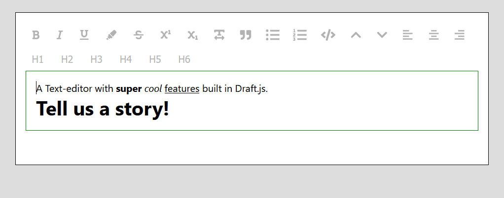

# Draft.js Editor

A Text-editor with **super** *cool* <ins>features</ins> built in [Draft.js](https://draftjs.org/).

### Image: 

## Usage:

- Working on a Full-Stack Blog App(Blogic), where this editor will serve for blog writing.
- Will release NPM package of this editor.

## Upcoming Features:

- Font size changable
- Font type changable
- Font Color changable
- Image Insertion
- Link Insertion(Hyperlinks)

## Installation:

1. Clone the repository. `git clone https://github.com/gupta-piyush19/Draft-JS-Editor.git`
2. Go to the project directory.
3. Run `npm i` or `yarn add` to install all the dependencies required.
4. Run `yarn start` in project directory to run the app.

